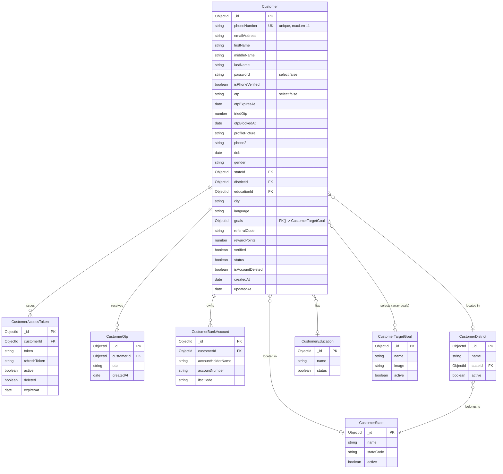
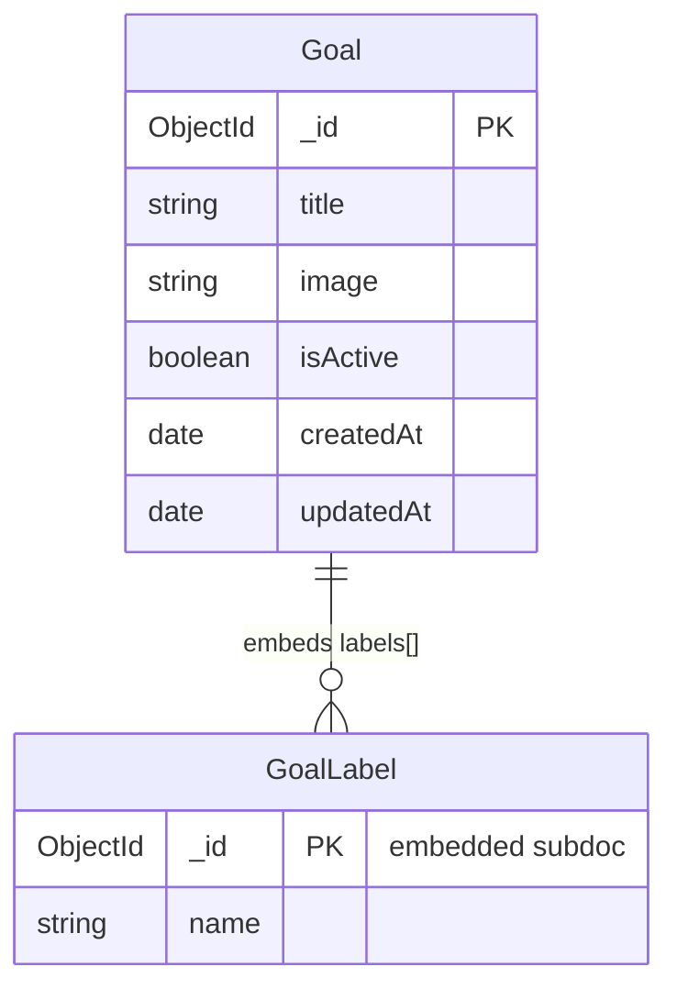
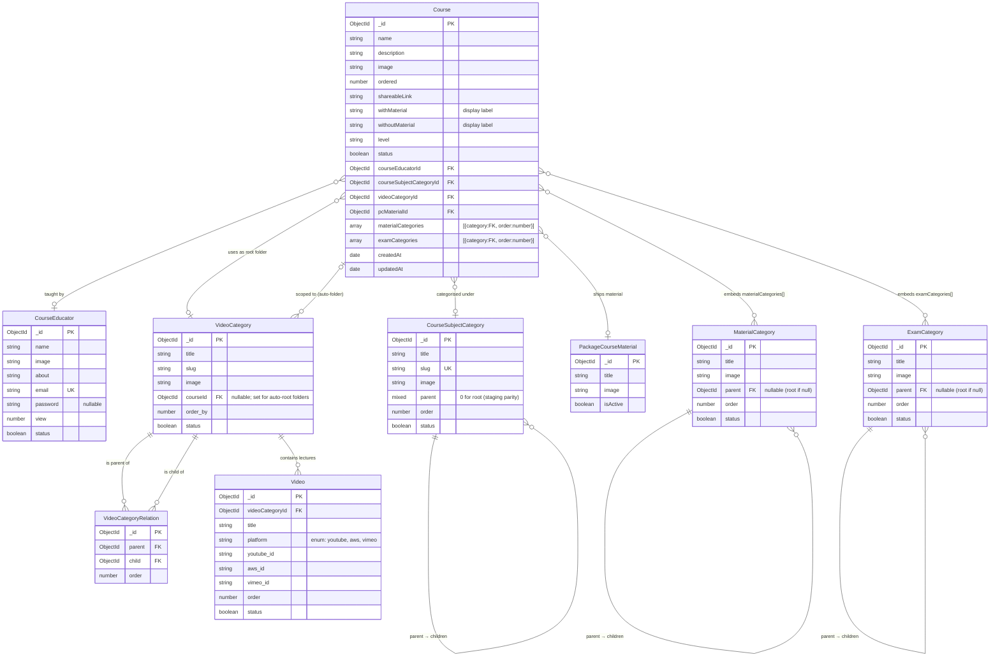
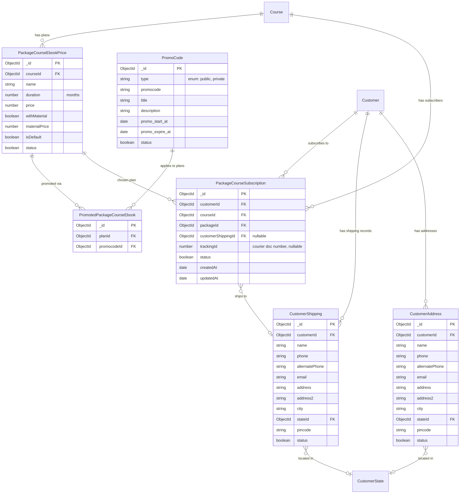

# Web Sankul — Entity Relationship Diagram

Derived from the Mongoose schemas in `src/models/**/*.model.ts`. Although the
backend is MongoDB (document model), the relationships are fully normalised
via `Schema.Types.ObjectId` + `ref` pointers, so an ER view is accurate.

**Notation (Mermaid crow's-foot):**

- `||--o{` one-to-many · `||--||` one-to-one · `}o--o{` many-to-many
- `}o--o|` many-to-zero-or-one (optional FK)
- **embedded array** means the child lives inside the parent document (no
  separate collection); still shown as a relationship for clarity.

Diagrams are split by bounded context to stay readable. Cross-context edges
(e.g. `Customer` → `Subscription`) are declared once in the context that owns
the child entity.

---

## 1. Customer & Authentication

### Goal (admin-managed goal catalog with embedded labels)

`Goal` is a separate entity from `CustomerTargetGoal`. It models the admin-side
*goal catalog* (e.g. "Career Growth") with an embedded array of labels
(e.g. "Interview Prep", "Resume Building"). The Customer's `goals[]` array
actually points at **label `_id`s nested inside Goal documents**, not at the
Goal itself — that's why the profile service uses an aggregation unwind.

---

## 2. Admin / RBAC

```mermaid
erDiagram
    AdminUser }o--o{ Role : "has (array:roles)"
    AdminUser }o--o{ Permission : "has (array:permissions)"
    AdminUser ||--o{ AdminAccessToken : "issues"

    AdminUser {
        ObjectId _id PK
        string   firstName
        string   lastName
        string   email UK
        string   password "select:false"
        string   image
        string   role "enum: super_admin, admin, editor"
        boolean  status
        boolean  isDark
        date     emailVerifiedAt
        string   rememberToken "select:false"
        date     lastLoginDate
        string   lastLoginIp
        date     lastSeenAt
        ObjectId roles "FK[] -> Role"
        ObjectId permissions "FK[] -> Permission"
        date     createdAt
        date     updatedAt
    }

    Role {
        ObjectId _id PK
        string   name
        string   guardName
    }

    Permission {
        ObjectId _id PK
        string   name
        string   guardName
    }

    AdminAccessToken {
        ObjectId _id PK
        ObjectId adminUserId FK
        string   token
        string   refreshToken
        boolean  active
        boolean  deleted
        date     expiresAt
    }
```

> **Note:** `role` (enum string) and `roles[]` (ref array) coexist. The string
> is the primary ACL input checked by `requireRole(...)` middleware; the
> `roles[]`/`permissions[]` arrays are scaffolded for future fine-grained RBAC
> but not yet consumed by a route handler.

---

## 3. Course Catalog & Video Hierarchy

The heart of the Course Management module. Key relationships:

- **Course** owns references to the four master tables (educator, subject,
  video-category, material).
- **VideoCategory** is self-referential via the join-collection
  `VideoCategoryRelation(parent, child)` (a true tree, unique on `(parent,
  child)`).
- **MaterialCategory** and **ExamCategory** are self-referential via a plain
  `parent: ObjectId | null` column (simple adjacency list tree).
- **Course ↔ MaterialCategory** and **Course ↔ ExamCategory** are modelled as
  **embedded arrays** on the Course document (not separate join collections) —
  this replaces SQL-style `MaterialCategoryCourse` / `ExamCategoryCourse` join
  tables from websankul-api-staging.
- **Video** (lecture) belongs to one `VideoCategory`.

---

## 4. Commerce: Plans · Promos · Subscriptions · Shipping

Separate context because it bridges **customer** and **course** — every arrow
here crosses a bounded-context boundary.

---

## 5. System / Content (no inter-entity relationships)

These are flat global-config or CMS-style entities. They're listed here for
completeness but have no foreign keys to other domains.

| Entity | Purpose |
|---|---|
| `AppUpdate` | Force-update manifest for mobile clients |
| `BannerSlider` | Home-page banners |
| `Department` | Internal admin grouping |
| `DynamicImage` | Keyed image slots for theming |
| `FAQ` | Public FAQ entries |
| `ImageNotification` | Image-based in-app notifications |
| `PopupNotification` | Interstitial popups |
| `TermsAndConditions` | Legal text |
| `Testimonial` | Homepage testimonials |
| `Version` | API/client version gating |

---

## Flow highlights (how the ER supports the 4 client routes)

| Route | Collections touched |
|---|---|
| `GET /api/v1/client/courses/:id` | `Course` → populate `CourseEducator`, `CourseSubjectCategory`, `MaterialCategory[]`, `ExamCategory[]` · `Video.find({videoCategoryId})` · `PackageCourseEbookPrice.find({courseId})` · `PromotedPackageCourseEbook.find({planId ∈ plans})` → populate `PromoCode` filtered by `type:public` |
| `POST /api/v1/client/courses/shipping` | Upsert `CustomerAddress` + `CustomerShipping` keyed by (customerId + normalized fields); populate `CustomerState` |
| `GET /api/v1/client/courses/orders/:id` | `PackageCourseSubscription.findOne({_id, customerId})` populate `Course`, `PackageCourseEbookPrice`, `CustomerShipping` — branch tracking URL on `trackingId < TIRUPATI.INITIAL_Number` |
| `GET /api/v1/client/courses/orders/:id/invoice` | `PackageCourseSubscription` → `Course` + `PackageCourseEbookPrice` → pdfkit stream |

## Cascade map (admin-side delete semantics)

| Action | Cascaded writes |
|---|---|
| `DELETE /admin/courses/:id` | `PackageCourseEbookPrice.deleteMany({courseId})` · `VideoCategory.deleteMany({courseId})` · `VideoCategoryRelation.deleteMany` where parent or child matches a deleted folder |
| `DELETE /admin/courses/video-categories/:id` | `VideoCategoryRelation.deleteMany` where parent or child == this id |
| `DELETE /admin/master/video-categories/:id` | Same relation sweep as above |
| `DELETE /admin/master/video-categories/:id` when a `Course` still references it | Blocked with 409 |
| `DELETE /admin/courses/materials/:id` when referenced by `Course.pcMaterialId` | Blocked with 409 |

---

*Generated from `src/models/**/*.model.ts`. Regenerate by re-reading the
schemas — there's no autogen tool yet; the above is kept in sync manually.*
